## Investigating Myonuclear Diversity in Mouse Muscle Using Single-Nucleus RNA Sequencing
## Methods
### Animals
The Institutional Animal Care and Use Committee at UC Irvine authorized all mouse studies, which were carried out by all applicable ethical guidelines for research and testing on animals. The Animal Research: Reporting of in Vivo investigations (ARRIVE) criteria are followed in all mouse-based investigations[1].
### Tissue Collection and Mice.
Muscle tissue samples were collected from five classical inbred strains (C57BL/6J, A/J, NOD/ShLtJ, NZO/HILtJ, and 129S1/SvImJ) and three wild-derived strains (PWK/PhJ, WSB/EiJ, and CAST/EiJ) using 10-week-old mice with equal representation of males and females. All animal procedures adhered to UC Irvine’s IACUC-approved protocol (AUP-21-106: "Mouse genomic variation at single-cell resolution") and institutional guidelines. Mice were housed in a pathogen-free, temperature-controlled facility with a 12-hour light/dark cycle (lights on 07:00–19:00). Gastrocnemius tissues were dissected between 09:00 and 15:00, snap-frozen in cryotubes with 1 mL Bambanker medium, and stored at -80°C until nuclei isolation[2]. 
### Purification and Nuclei fixation
Frozen tissues were thawed on ice in Bambanker medium, dissociated in Nuclei Extraction Buffer with RNase Inhibitor using a gentleMACS Octo Dissociator, and filtered through 70 μm and 30 μm strainers. Nuclei were resuspended in PBS with 7.5% BSA and RNase Inhibitor, then counted with DAPI staining. For fixation, 4 million nuclei per sample were treated with the Parse Biosciences Nuclei Fixation Kit v2, centrifuged, resuspended in Nuclei Buffer, mixed with DMSO, and frozen at −80°C in a Mr. Frosty container [2]. 
### Single-Nucleus RNA Sequencing (snRNA-seq)
Fixed nuclei were incubated with probes to capture mRNA, barcoded during encapsulation, and reverse-transcribed into cDNA. cDNA was amplified and converted into sequencing libraries using the 10x Genomics platform, following the manufacturer’s protocol. Libraries were sequenced on an Illumina platform, targeting ~50,000 reads per nucleus[3, 8].
### Data Preprocessing
scRNA-seq data from gastrocnemius muscle of 8 mouse strains were analyzed using Seurat (v5.1.0). Raw data were processed to quantify muscle-specific transcripts and assign genetic profiles. Low-quality cells, noise, and doublets were filtered with DoubletFinder, resulting in 56,953 features across 24,000 cells. Cells with <200 or >2,500 features were excluded. Data were log-normalized, top 2,000 variable genes identified via the VST method, and scaled for analysis
### Visualization of Cell Clusters
UMAP was used for dimensionality reduction and visualization of cell clusters, based on the top 10 principal components from PCA. Cells were color-coded by cluster to assess group separation and composition.
###  Data and Code Availability
All data extracted from the link hosted on [GitHub](https://github.com/mortazavilab/parse_pipeline/tree/cellbender_hpc). 
## Result
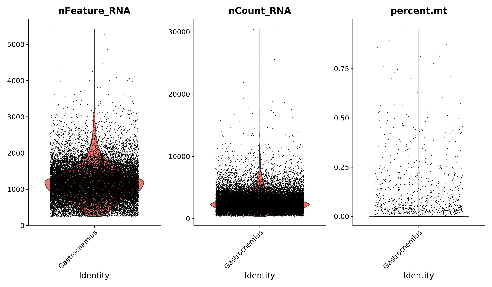
#### Figure 1.
 The violin plot displays three QC metrics: detected features (nFeature_RNA), total RNA counts (nCount_RNA), and mitochondrial gene percentage. It highlights cells with abnormal values, aiding in the identification of outliers or potential quality issues for filtering

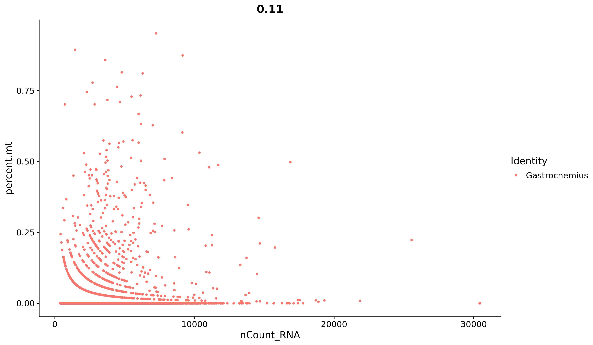
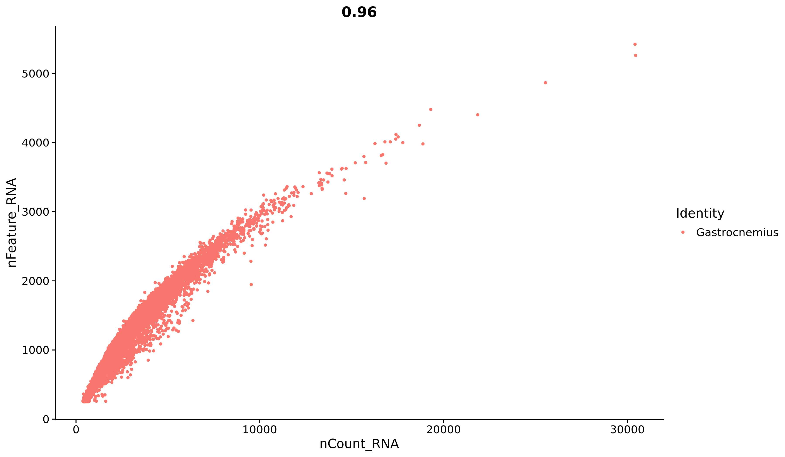
### Figure 2.
The FeatureScatter plots are used to examine relationships between different QC metrics in the dataset. The first plot visualizes the relationship between the total RNA count and the percentage of mitochondrial RNA, while the second plot shows the relationship between RNA count and the number of detected features. Both plots are combined to provide a comprehensive view of how these metrics correlate across the cells in the dataset.

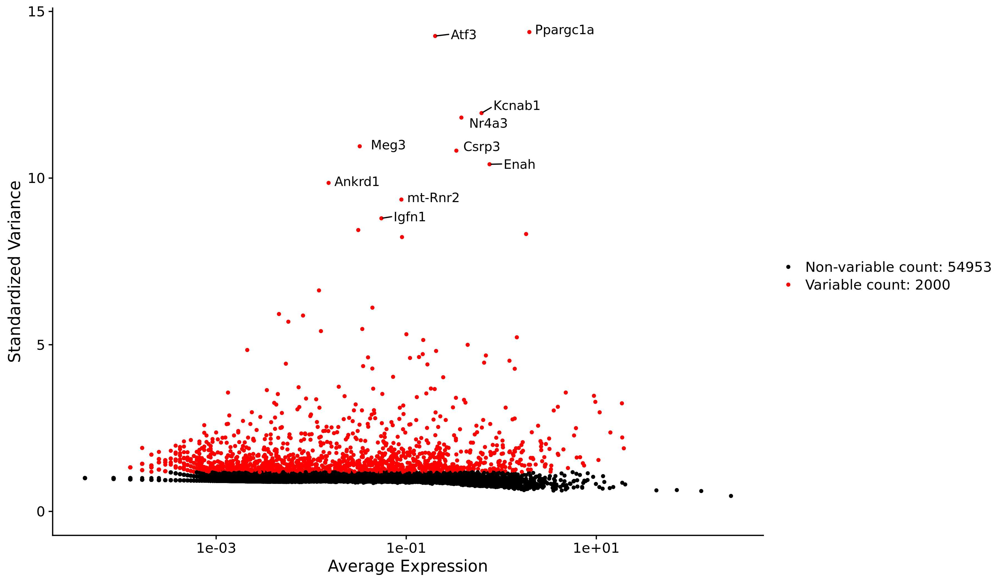
### Figure 3. Identification of Highly Variable Features.
The plot shows the relationship between mean expression and variance across genes in the dataset. Highly variable genes, which are selected for downstream analyses, are identified based on their deviation from the expected mean-variance trend. The top 2,000 most variable features were chosen using Seurat's function and will be used in subsequent steps.

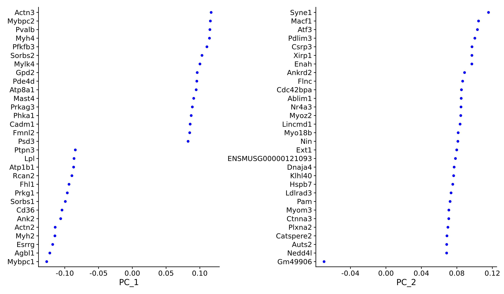
### Figure 4. The VizDimLoadings plot 
shows the influence of individual genes on the first two principal components (PC1 and PC2) from PCA. Genes farther from the origin have stronger contributions, with those driving PC1 reflecting major biological or experimental factors, while genes influencing PC2 represent secondary variation. This highlights key genes shaping the dataset’s structure.

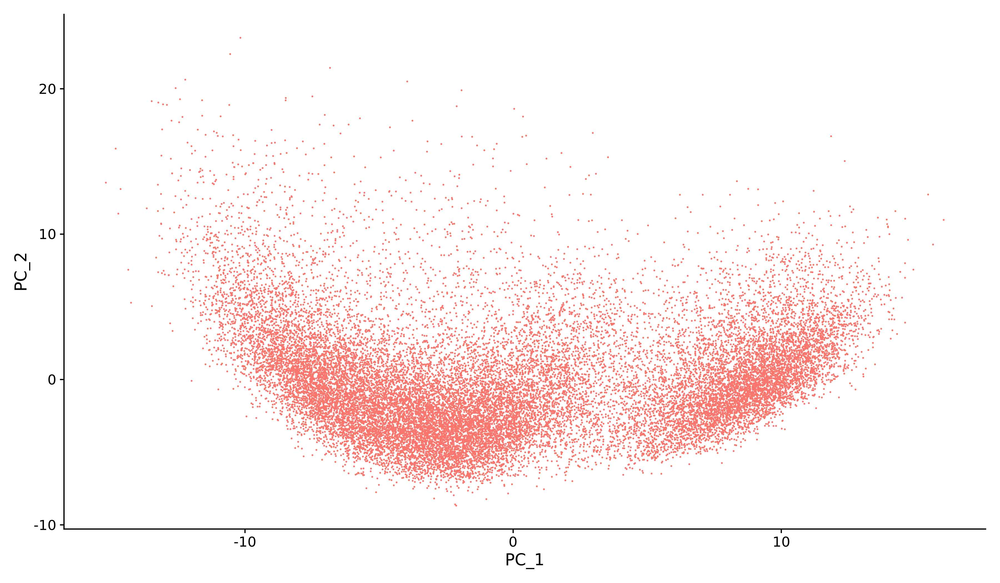
### Figure 5. The DimPlot
The scatter plot displays cells based on their projections onto PC1 and PC2, which capture the most variation in the dataset. Cells with similar gene expression cluster together, while distinct profiles appear farther apart, visually highlighting transcriptional relationships and separations.

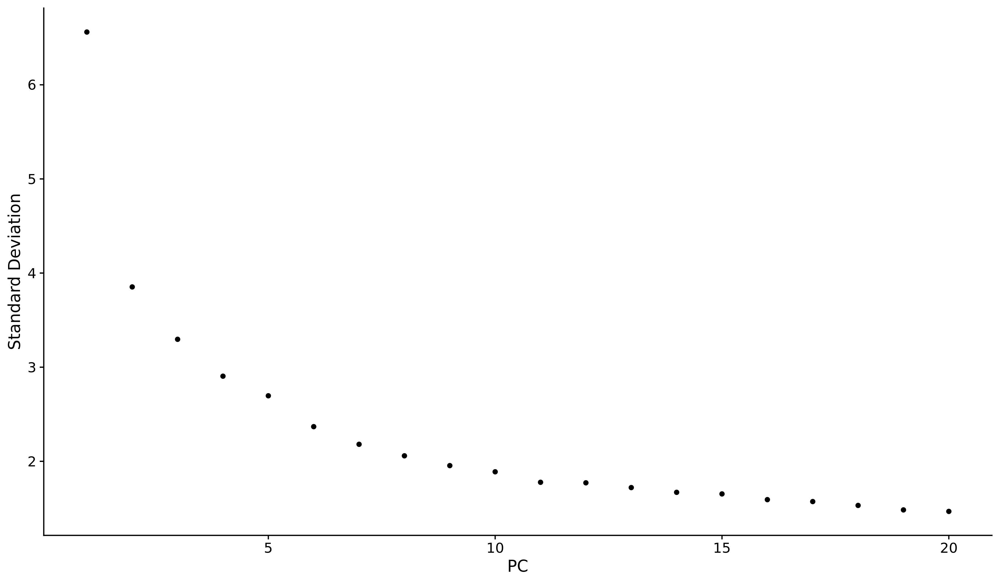
### Figure 6. The ElbowPlot
The plot shows the variance explained by each principal component (y-axis) against the component number (x-axis). The "elbow" point, where variance levels off, indicates the optimal number of PCs to retain for downstream analysis.

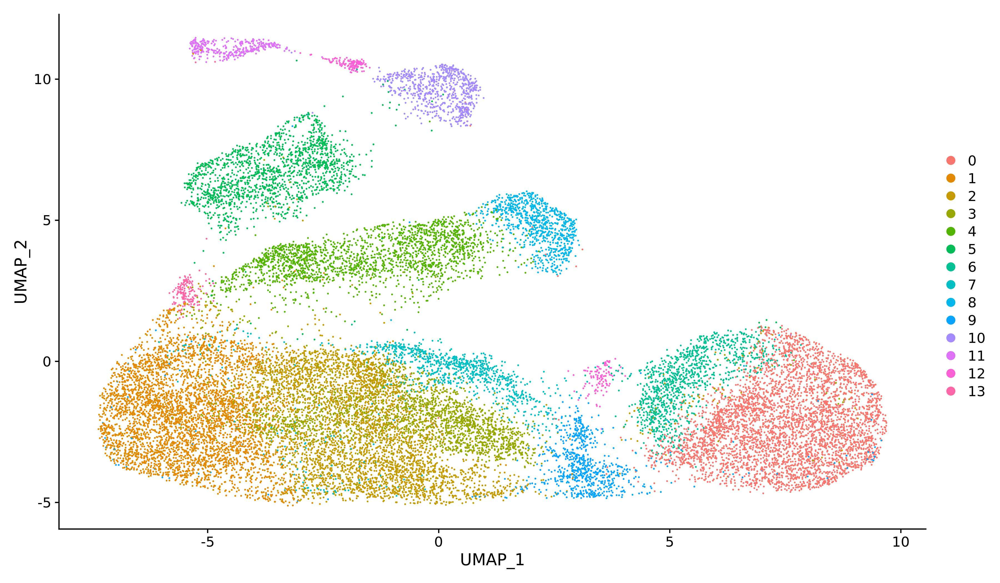
### Figure 7. 

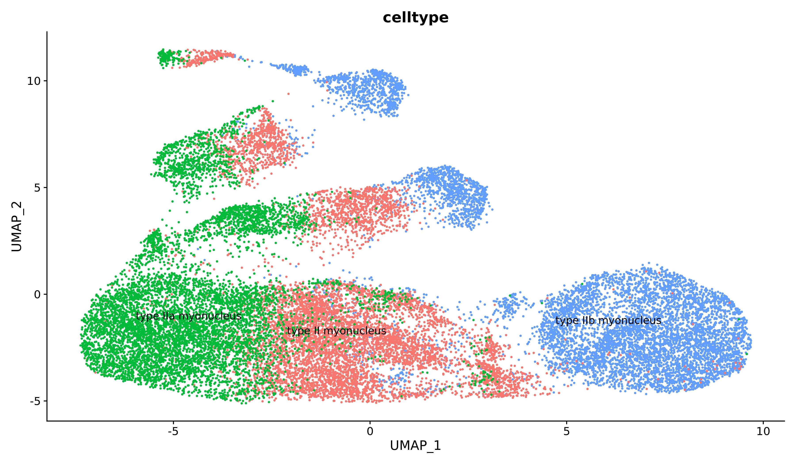
### Figure 8. 
UMAP is used to identify and visualize 3 different cell types (Type lla, Type ll and Type llb myonucleus) based on gene expression. Cells with similar transcriptional profiles cluster together, enabling clear distinction of different cell types

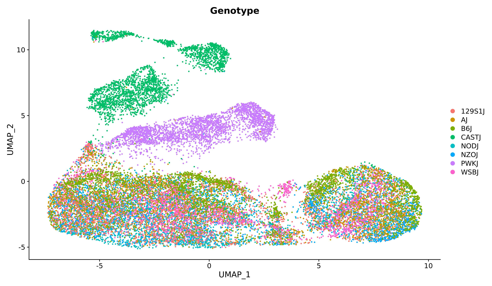
### Figure 9. 
UMAP can reveal genetic variation by clustering cells from different genotypes ( 8 different starins), highlighting how genetic differences influence muscle gene expression patterns.

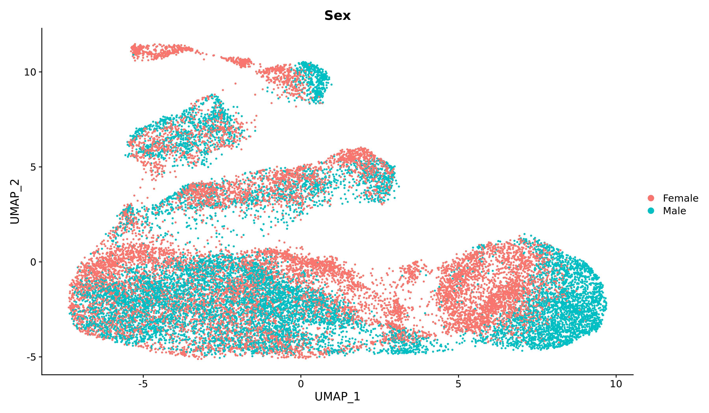
### Figure 10.
 UMAP shows  sex-based differences in gene expression, with cells from different sexes clustering separately in different color, reflecting sex-specific biological variations in gene activity.

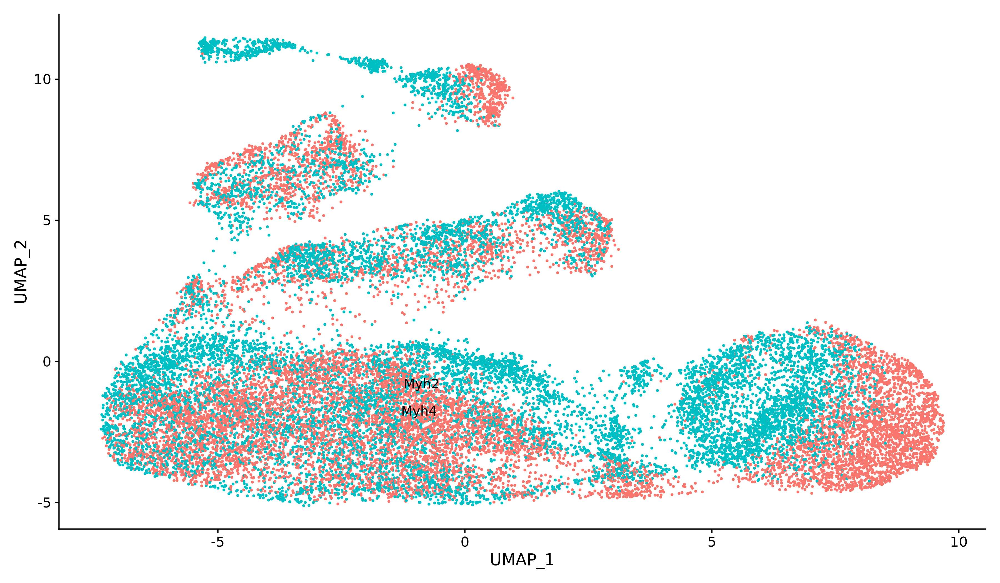
### Figure 11. 
UMAP represent the different 2 cell type expression. 

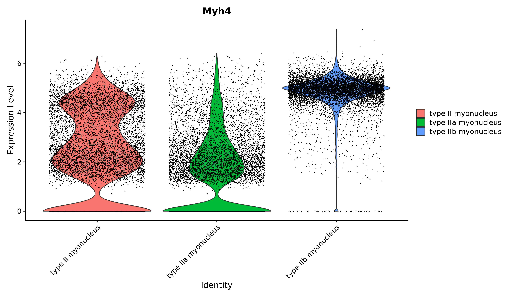
### Figure 12. 
The violin plot shows Myh4 expression across cell types, to visualize gene expression variation by cell type.

## Result
This study investigated myonuclear diversity in mouse gastrocnemius muscle using snRNA-seq data from eight genetically diverse strains, considering both sexes. The results highlight distinct differences in gene expression, both between strains and between sexes, suggesting significant contributions of genetic background and sex to myonuclear diversity. UMAP clustering provided clear visualization of these differences as shown in figure 8 and 9, while differential gene expression patterns in fast-twitch (type II) myonuclei revealed further complexity. The CAST/EiJ female strain, in particular, demonstrated a notable accumulation of type IIa myonuclear gene expression, emphasizing the need for further investigation into the molecular mechanisms driving such strain-specific patterns.

Our findings align with prior research on sex-biased gene expression and strain-specific variability in muscle physiology, supporting the idea that these factors influence the function and specialization of myonuclear subtypes. One of the most prevalent proteins found in adult myofibers, MYH, plays a key role in determining how quickly myofibers contract [3] Differential expression of Myh4 as shown in figure 12 in 3 different cell types,which is a fast-tye myofiberl across the three fast-twitch myonuclear subtypes underscores the need for a deeper understanding of the unique roles of these cell types in muscle function. Such findings are consistent with existing studies showing the complexity of sex-biased gene expression, reflecting cell type-specific variability and developmental differences in gene regulation [4, 5].

However, several limitations must be considered, including potential batch effects and biases inherent to single-nucleus sequencing. Future studies should focus on expanding strain and sample size, as well as integrating additional data types, such as chromatin accessibility (snATAC-seq and Share-seq),to have a more thorough comprehension of myonuclear diversity[6]. Confirming the biological importance of these discoveries would need functional validation using experimental models, and sophisticated statistical techniques may improve clustering and cell type categorization even further.

In conclusion, this research offers important new information on the sex-based and genetic differences in myonuclear gene expression, especially in fast-twitch muscle fibers. Setting the stage for future investigations into the epigenetic and functional components of these patterns, the CAST/EiJ female strain provides an interesting model for more study of the regulatory networks underpinning myonuclear diversity and muscle performance.

## Refrences
1. Tran, K.M., Kawauchi, S., Kramár, E.A. et al. A Trem2R47H mouse model without cryptic splicing drives age- and disease-dependent tissue damage and synaptic loss in response to plaques. Mol Neurodegeneration 18, 12 (2023). https://doi.org/10.1186/s13024-023-00598-4
2. Loving, Rebekah K et al. “Long-read sequencing transcriptome quantification with lr-kallisto.” bioRxiv : the preprint server for biology2024.07.19.604364. 9 Sep. 2024, doi:10.1101/2024.07.19.604364. Preprint.
3. Weihua Zeng, Shan Jiang, Xiangduo Kong, Nicole El-Ali, Alexander R. Ball, Christopher I-Hsing Ma, Naohiro Hashimoto, Kyoko Yokomori, Ali Mortazavi, Single-nucleus RNA-seq of differentiating human myoblasts reveals the extent of fate heterogeneity, Nucleic Acids Research, Volume 44, Issue 21, December 2016, Page e158, https://doi.org/10.1093/nar/gkw739
4. Dos Santos, M., Backer, S., Auradé, F. et al. A fast Myosin super enhancer dictates muscle fiber phenotype through competitive interactions with Myosin genes. Nat Commun 13, 1039 (2022). https://doi.org/10.1038/s41467-022-28666-1
5. Harrison, M. J., T. L. Lee, A. J. Campbell, et al. (2015). "Sex-biased gene expression and regulatory effects in skeletal muscle." eLife, 4, e08456.
6. Khodursky, A. B., D. J. Eisen, L. F. Gibbons, et al. (2020). "Strain-specific genetic influences on muscle development and function in mice." BMC Biology, 18(1), 24.
7. Grandi, F.C., Modi, H., Kampman, L. et al. Chromatin accessibility profiling by ATAC-seq.Nat Protoc 17, 1518–1552 (2022). https://doi.org/10.1038/s41596-022-00692-9
8. Sant, Pooja et al. “Approaches for single-cell RNA sequencing across tissues and cell types.” Transcriptionvol. 14,3-5 (2023): 127-145. doi:10.1080/21541264.2023.2200721

