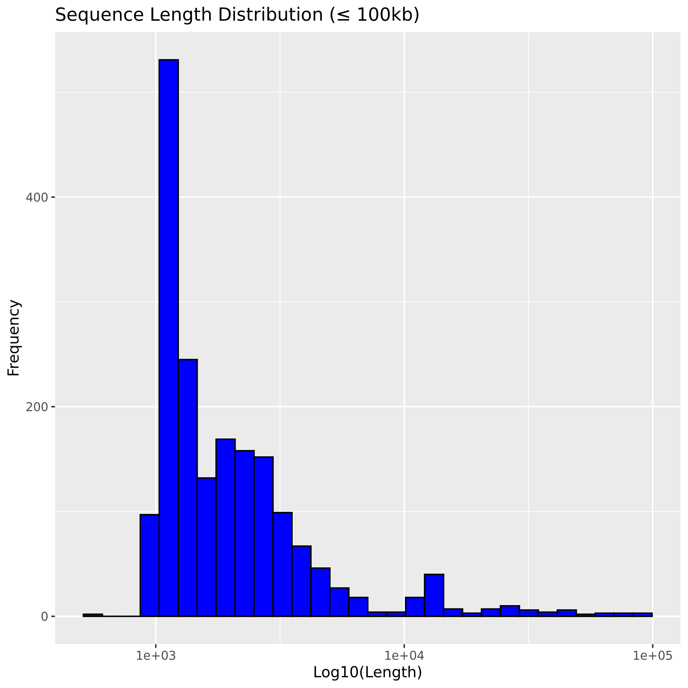
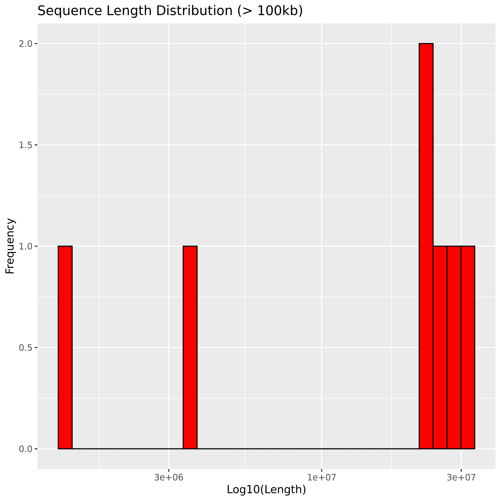
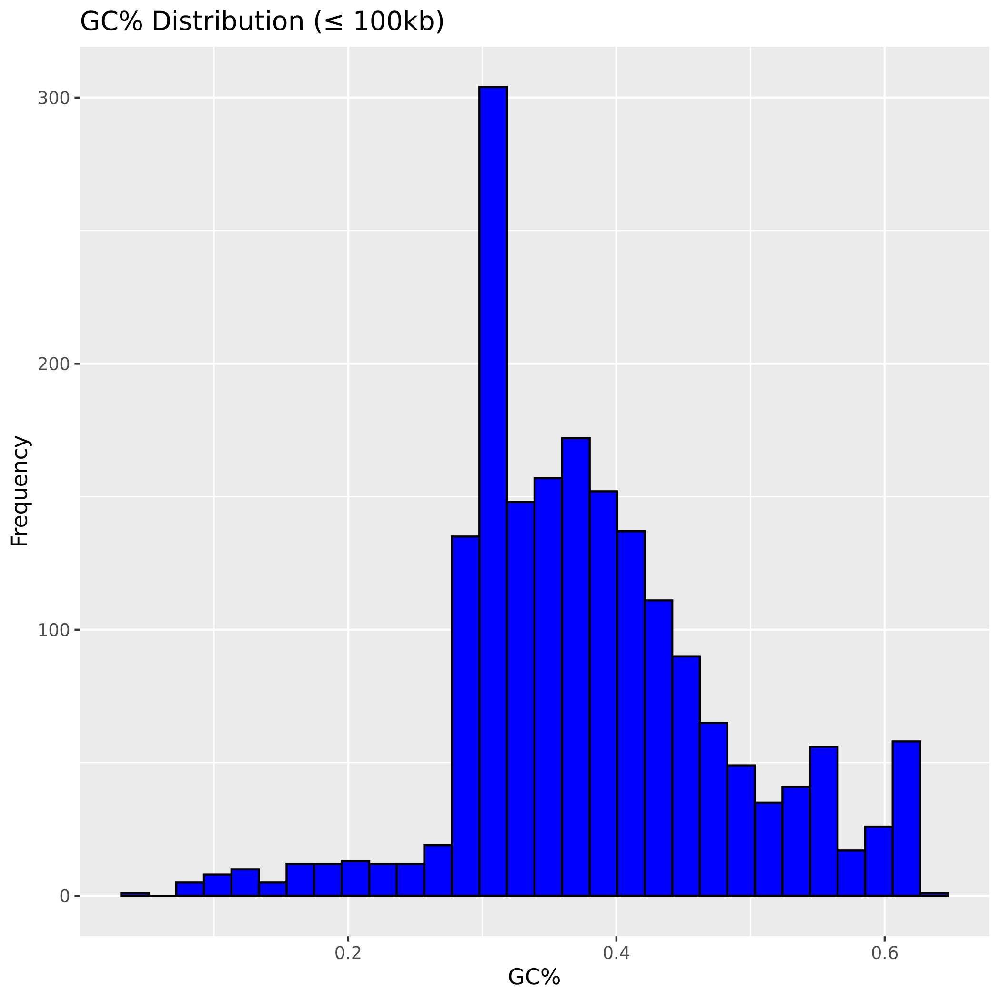
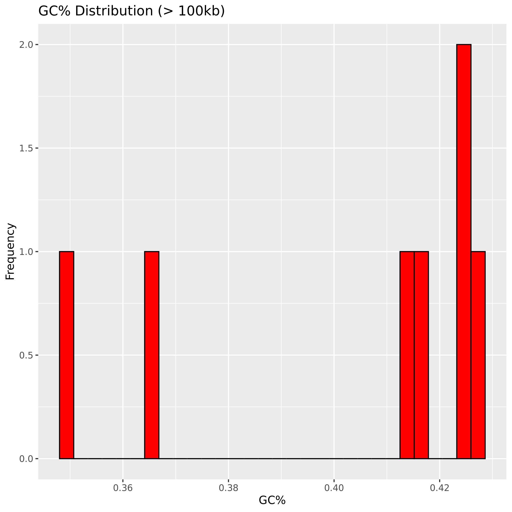
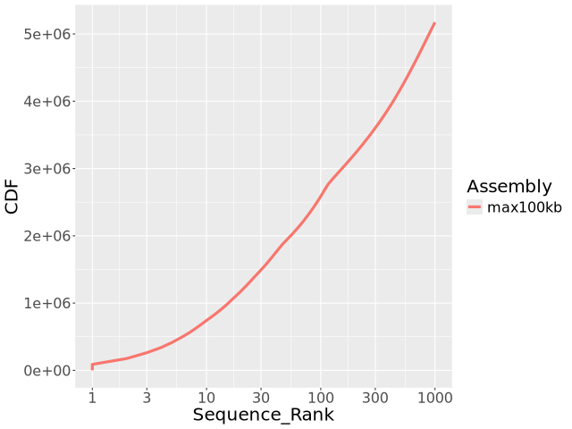
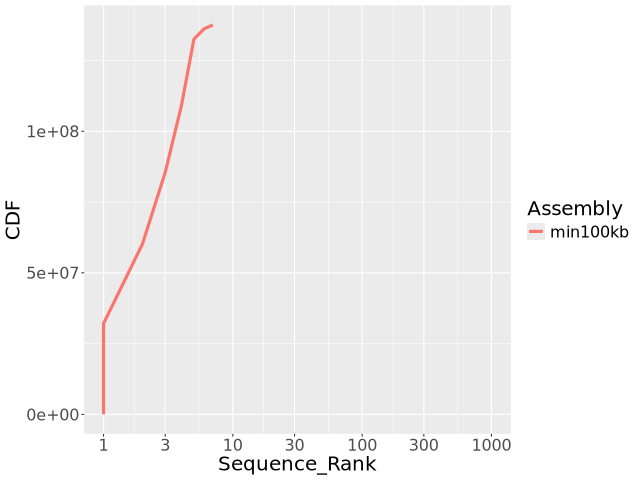
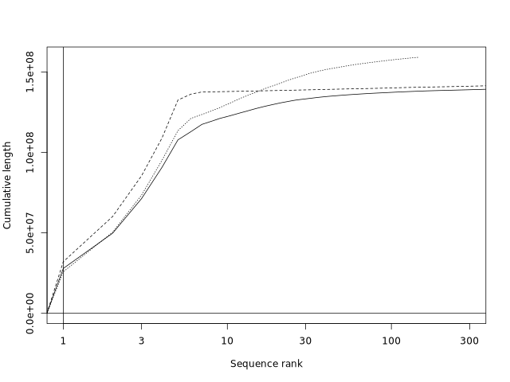

# Homework 4: pipelines, plotting, genome assembly

In this homework, I am working on analyzing the Drosophila melanogaster genome. First, I will download the latest gzipped fasta file for the genome and partition it into two groups based on sequence length: sequences ≤ 100kb and sequences > 100kb. For each partition, I will calculate the total number of nucleotides, Ns, and sequences. I will also generate histograms to visualize the sequence length distribution, GC% distribution, and cumulative sequence size. Next, I will assemble a genome using PacBio HiFi reads with the hifiasm tool on HPC3. After the assembly is complete, I will convert the output into fasta format and calculate the N50, comparing it with the reference Drosophila assembly. To assess the quality of the assembly, I will generate contiguity plots and calculate BUSCO scores for comparison. Finally, I will organize my results in markdown and script files, which will be uploaded to my GitHub repository for review.

## Summarize partitions of a genome assembly

First, I download the chormosom files using the following command:
```
wget -O dmel-all-chromosome-r6.60.fasta.gz http://ftp.flybase.net/genomes/Drosophila_melanogaster/current/fasta/dmel-all-chromosome-r6.60.fasta.gz
```

Then I split the data into 2 fasta files by running the following commands:
```
bioawk -c fastx '{ if (length($seq) <= 100000) print ">"$name"\n"$seq }' data/raw/dmel-all-chromosome-r6.60.fasta.gz > data/raw/max_100kb.fasta
bioawk -c fastx '{ if (length($seq) > 100000) print ">"$name"\n"$seq }' data/raw/dmel-all-chromosome-r6.60.fasta.gz > data/raw/min_100kb.fasta
```

### Calculate the following for all sequences ≤ 100kb and all sequences > 100kb:

##### Starting with sequences ≤ 100kb
1. Total number of nucleotides
```
bioawk -c fastx '{ total += length($seq) } END { print "Total Nucleotides (≤100kb):", total }' data/raw/max_100kb.fasta
```
Output: Total Nucleotides (≤100kb):     6178042

2. Total number of Ns
```
bioawk -c fastx '{ count += gsub(/[Nn]/, "N", $seq) } END { print "Total Ns (≤100kb):", count }' data/raw/max_100kb.fasta
```
Output: Total Ns (≤100kb):      662593

3. Total number of sequences
```
bioawk -c fastx 'END { print "Total Sequences (≤100kb):", NR }' data/raw/max_100kb.fasta
```
Total Sequences (≤100kb):       1863


##### Continuing with sequences > 100kb
1. Total number of nucleotides
```
bioawk -c fastx '{ total += length($seq) } END { print "Total Nucleotides (≤100kb):", total }' data/raw/min_100kb.fasta
```
Output: Total Nucleotides (≤100kb):     137547960

2. Total number of Ns
```
bioawk -c fastx '{ count += gsub(/[Nn]/, "N", $seq) } END { print "Total Ns (≤100kb):", count }' data/raw/min_100kb.fasta
```
Output: Total Ns (≤100kb):      490385

3. Total number of sequences
```
bioawk -c fastx 'END { print "Total Sequences (≤100kb):", NR }' data/raw/min_100kb.fasta
```
Output: Total Sequences (≤100kb):       7


# Plots of the following for for all sequences ≤ 100kb and all sequences > 100kb:
## Preparing data
```
bioawk -c fastx '{ print length($seq), gc($seq) }' data/raw/min_100kb.fasta > data/processed/metric_min_100kb.txt
bioawk -c fastx '{ print length($seq), gc($seq) }' data/raw/max_100kb.fasta > data/processed/metric_max_100kb.txt
```

Running a R sctript located in the ``` code/scripts``` directory
```
Rscript code/scripts/homework4_plot_histograms.r 
```





##### Sorting the data for the cumulative graph
```
bioawk -c fastx '{ print length($seq)}' data/raw/min_100kb.fasta | sort -rn  | awk 'BEGIN {print "Assembly\tLength\nmin100kb\t0"} {print "min100kb\t" $1}'  > data/processed/lengths_min_100kb.txt 
bioawk -c fastx '{ print length($seq)}' data/raw/max_100kb.fasta | sort -rn  | awk 'BEGIN {print "Assembly\tLength\nmax100kb\t0"} {print "max100kb\t" $1}'  > data/processed/lengths_max_100kb.txt 
```

##### Plotting the final 2 graphs
```
./bin/plotCDF2 data/processed/lengths_max_100kb.txt data/output/cumulative_max_sizes.png
./bin/plotCDF2 data/processed/lengths_min_100kb.txt data/output/cumulative_min_sizes.png
```



# Genome assembly
## Assemble a genome using Pacbio HiFi reads
##### Reserving computing resouces
```
srun -A class_ee282 --pty --cpus-per-task=16 bash -i
```
##### Assembling Reads using ```hifiasm``` with 16 core cpu
```
hifiasm -o data/iso1/iso1_assembly -t 16 data/raw/ISO1_Hifi_AdaptorRem.40X.fasta.gz 
awk '/^S/{print ">"$2"\n"$3}' data/iso1/*.bp.p_ctg.gfa > data/processed/assembly.fasta
```
## Assembly assessment
Preparing HiFi data for assessment and calculating N50 of the assembly.
```
faSize -detailed data/processed/assembly.fasta > data/processed/contig_lengths.txt
awk '{print $2}' data/processed/contig_lengths.txt | sort -rn > data/processed/sorted_contig_lengths.txt
awk '{sum += $1; lengths[NR] = $1} END {total = sum / 2; for (i = 1; i <= NR; i++) {sum -= lengths[i]; if (sum <= total) {print lengths[i]; exit}}}' data/processed/sorted_contig_lengths.txt
```
Output: ```21715751(21.7Mb)```


##### Preparing scaffold data
```
r6url="https://ftp.ncbi.nlm.nih.gov/genomes/all/GCA/000/001/215/GCA_000001215.4_Release_6_plus_ISO1_MT/GCA_000001215.4_Release_6_plus_ISO1_MT_genomic.fna.gz"
wget -O data/raw/ISO1.r6.scaff.fa.gz -q $r6url
faSize -detailed data/raw/ISO1.r6.scaff.fa.gz > data/processed/ISO1.r6.scaff.unsorted.namesizes.txt
sort -rnk 2,2 data/processed/ISO1.r6.scaff.unsorted.namesizes.txt > data/processed/ISO1.r6.scaff.sorted.namesizes.txt
cut -f 2 data/processed/ISO1.r6.scaff.sorted.namesizes.txt > data/processed/ISO1.r6.scaff.sorted.sizes.txt
```
##### Preparing contig data
```
faSplitByN data/raw/ISO1.r6.scaff.fa.gz data/raw/ISO1.r6.ctg.fa 10
gzip data/raw/ISO1.r6.ctg.fa
faSize -detailed data/raw/ISO1.r6.ctg.fa.gz > data/processed/ISO1.r6.ctg.unsorted.namesizes.txt
sort -rnk 2,2 data/processed/ISO1.r6.ctg.unsorted.namesizes.txt > data/processed/ISO1.r6.ctg.sorted.namesizes.txt
cut -f 2 data/processed/ISO1.r6.ctg.sorted.namesizes.txt > data/processed/ISO1.r6.ctg.sorted.sizes.txt
```

Plotting a graph using scaffold, contig, and assemply data using ```plotCDF```
```
./bin/plotCDF data/processed/*.sizes.txt data/processed/sorted_contig_lengths.txt data/output/assembly_assessment.png
```

##### Calculating BUSCO scores

First we'll create a separate python environment and installing compleasm
```
conda create -n compleasm_env python=3.9 -c conda-forge
mamba activate
conda activate compleasm_env
mamba install -c bioconda compleasm
```

Running compleasm to calculate the BUSCO score
```
compleasm run -a data/raw/ISO1.r6.ctg.fa.gz -o data/output/compleasm -l diptera_odb10
```

# Output:
## Drosophila lineage: diptera_odb10
S:99.70%, 3275
D:0.30%, 10
F:0.00%, 0
I:0.00%, 0
M:0.00%, 0
N:3285

## ISO Assembly Drosophila lineage: diptera_odb10
S:99.70%, 3275
D:0.30%, 10
F:0.00%, 0
I:0.00%, 0
M:0.00%, 0
N:3285
